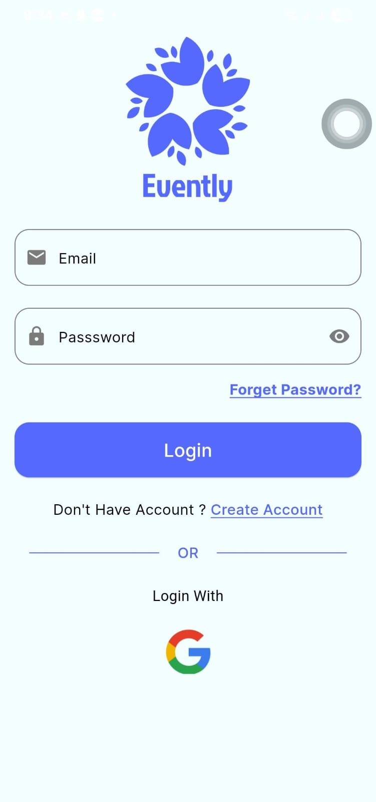
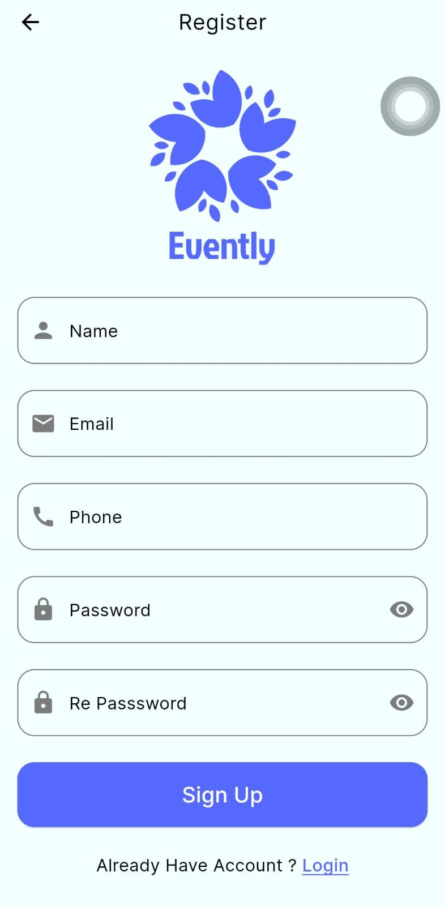
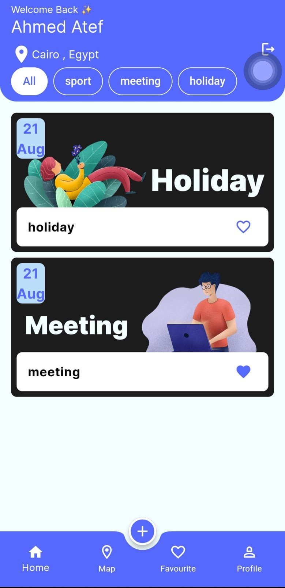
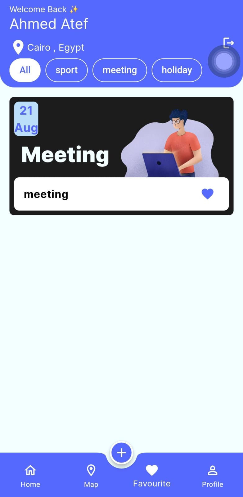
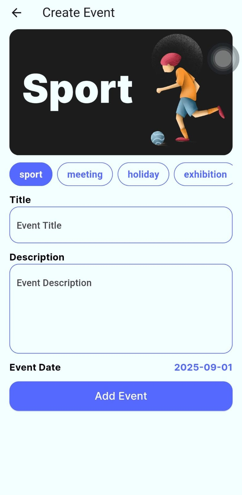
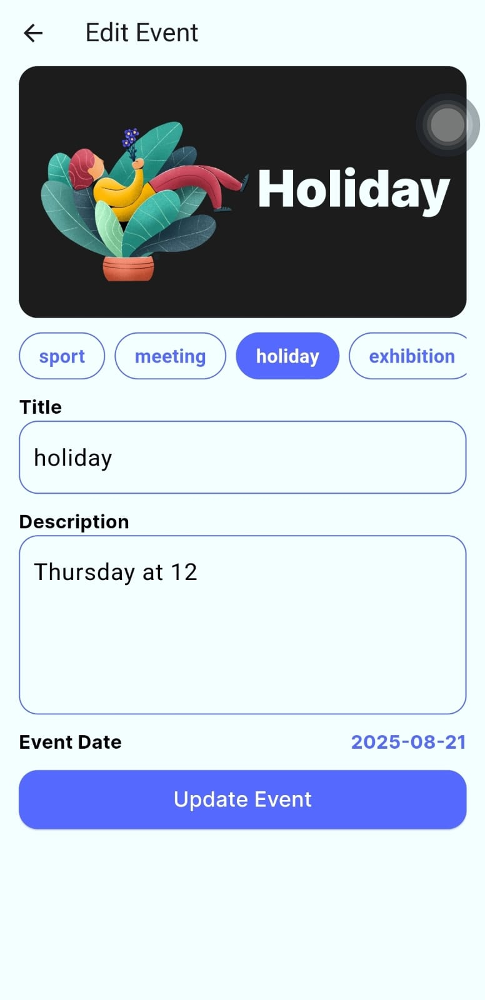

# 🎉 Evently App

A Flutter & Firebase-based event management application.  
Users can create and manage events, browse by date & category, and enjoy multi-language support (AR/EN) with light/dark mode.

---

## 🚀 Features
- Secure Authentication (Email / Google)
- Event Creation & Management (Firestore)
- Personalized Event Display (by date & category)
- Multi-language Support (Arabic / English)
- Dark & Light Mode
- State Management with Provider
- Local Storage with Shared Preferences
- Responsive UI

---

## 📸 Screenshots

  
  
  

  
  
  

---

## 🛠️ Technologies
- **Flutter & Dart**
- **Firebase (Auth, Firestore, Storage)**
- **Provider (State Management)**
- **Shared Preferences (Local Storage)**
- **ScreenUtil (Responsive UI)**
- **Google Maps Integration**

---

## 🔗 Links
- [GitHub Repository](https://github.com/AhmedAtef202/evently)
